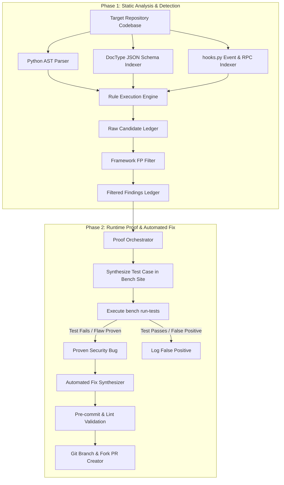

# 🛡️ Frappe Security Scanner

An enterprise-grade, static-analysis and runtime-proof security engine built specifically for the **Frappe Framework ecosystem** (including Frappe core, ERPNext, HRMS, and custom apps).

---

## 📐 Architecture Overview



---

## ⚡ Quick Start

```bash
# Clone the repository
git clone https://github.com/pratheep-bit/frappe-security-engine.git
cd frappe-security-engine

# Run static scan against a Frappe app repository
PYTHONPATH=. python3 scanner/cli.py scan /path/to/target/app
```

---

## 📊 Core Rules & Taxonomy

- **`FR-PERM-001`**: Whitelisted RPC endpoint missing permission check
- **`FR-WKFL-003`**: Status mutations missing `docstatus` state guard
- **`FR-WKFL-004`**: Submittable amendment chain reset missing
- **`FR-SQLI-004`**: Dynamic table/column identifier in QueryBuilder
- **`FR-SSRF-001`**: Outbound HTTP request URL parameter validation

---

## 📄 License

MIT License.

- ****: Unfiltered or raw data fetching queries

## 🧪 Test Execution

Run suite via pytest:
```bash
pytest tests/
```

## ⚙️ Configuration Reference

YAML configuration file structure details.

## 🤝 Contributing

Pull requests and rule additions welcome.

## 🔒 Security Policy

Report vulnerabilities securely.
