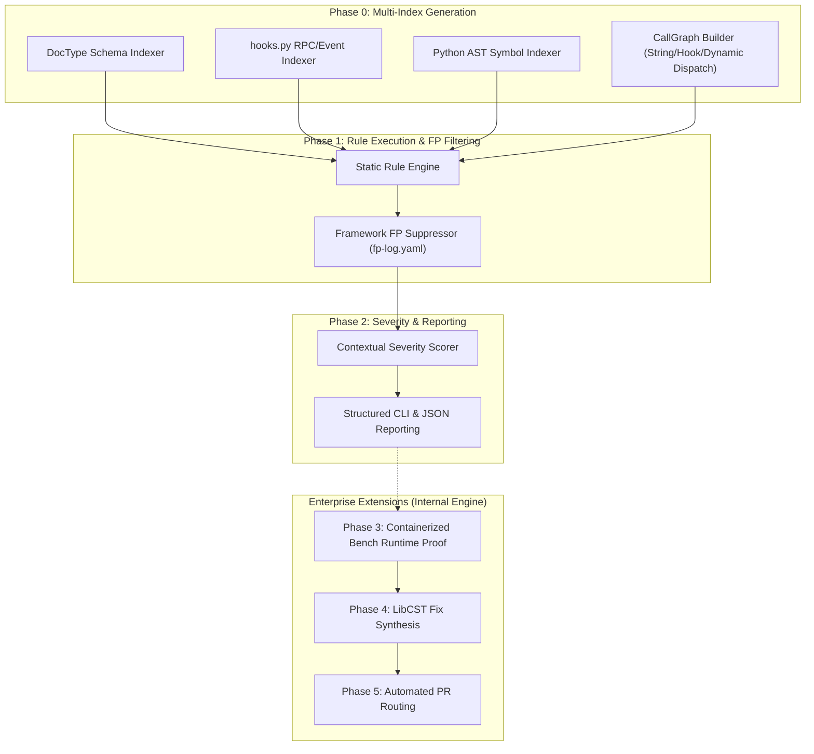

# 🛡️ Frappe Security Scanner — Master Reference Manual

An open-source static analysis engine purpose-built for the **Frappe Framework ecosystem** (Frappe core, ERPNext, HRMS, and custom Frappe apps).

---

## 1. Executive Summary

The Frappe Security Scanner detects security flaws, access control bypasses, and state-machine violations in Frappe applications. Unlike generic Python SAST tools that produce false positives on framework idioms, this scanner parses DocType schemas, `hooks.py` registrations, and Python AST into three cooperating indexes to evaluate framework-aware rules.

This repository contains the **open-source static analysis core** (indexing, call graph analysis, static rule detection, false-positive suppression, and severity scoring).

---

## 2. Pipeline Architecture



---

## 3. Core Taxonomy & Rules Registry

The static engine enforces rules across security families tailored to Frappe:

| Family | Category | Key Rule IDs | Description |
|---|---|---|---|
| **`FR-PERM`** | Permission & Access Control | `FR-PERM-001` - `FR-PERM-006` | Missing `has_permission()` in whitelisted RPC endpoints; `ignore_permissions=True` bypasses. |
| **`FR-SQLI`** | ORM vs Raw SQL Boundary | `FR-SQLI-001` - `FR-SQLI-004` | Format-string SQL injection in `frappe.db.sql()`; missing `docstatus` filter; raw `set_value`. |
| **`FR-HOOK`** | Hook & Lifecycle Safety | `FR-HOOK-001` - `FR-HOOK-007` | Asymmetric `on_submit` lifecycle hooks; missing job deduplication keys in `frappe.enqueue()`. |
| **`FR-WKFL`** | Workflow & State Machine | `FR-WKFL-001` - `FR-WKFL-004` | Status field mutation missing `docstatus` guard; submittable amendment chain reset missing. |
| **`FR-INJ`** | API & Injection Surfaces | `FR-INJ-001` - `FR-INJ-005` | Mass assignment via `get_doc(kwargs)`; dangerous `eval()`; unsanitized HTML rendering in RPC. |
| **`FR-DATA`** | Child Tables & Multi-Tenancy | `FR-DATA-001` - `FR-DATA-003` | DocType field name mismatches; child table orphan records; cross-tenant query leaks. |

---

## 4. Evidence Tiers & Enterprise Engine Scope

In the complete enterprise pipeline, findings progress through 4 evidence tiers to ensure zero-false-positive PR automation:

| Tier | Status | Trigger / Mechanism | Scope |
|---|---|---|---|
| **Tier 0** | Candidate | Static AST rule match | Open-Source Static Engine |
| **Tier 1** | Direct Call Proven | Containerized Python reproducer execution | Full Internal Engine |
| **Tier 2** | HTTP RPC Proven | Authentic HTTP POST assertion against bench site | Full Internal Engine |
| **Tier 3** | Upstream Merged | Merged PR in Frappe/ERPNext/HRMS core | Upstream Evidence |

*Note: Automated LibCST fix synthesis (available in the full internal engine) operates fail-closed: complex rules such as `FR-PERM-002` (ignore_permissions guard) and `FR-SQLI-004` (QueryBuilder dynamic identifiers) intentionally return `None` and fall back to manual developer triage because AST analysis alone cannot infer target DocTypes or identifier allowlists without human confirmation.*

---

## 5. Architectural Invariants

1. **Frozen Dataclass Protection**: `Candidate` instances are immutable. All mutations use `Candidate.with_status()` or `dataclasses.replace()`.
2. **GC-Safe Double-Tuple Caching**: Reachability caches use `(id(python), id(graph))` identity keys and validate `cached[0] is python and cached[1] is graph` to prevent stale evaluation from Python GC address re-use.
3. **Multi-Directory Findings Discovery**: `discover_all_findings_dirs()` dynamically discovers `findings/` and sibling `findings_latest_*` directories.
4. **Atomic Disk Persistence**: `ledger_io.py` writes ledgers using `NamedTemporaryFile` + `os.replace` under thread-safe file locks.

---

## 6. Package Directory Structure

```
scanner/                          <- Workspace Root
├── pyproject.toml                <- PEP 621 build configuration
├── README.md                     <- Open-source product manual
├── CONTRIBUTING.md               <- Developer contribution guide
├── CHANGELOG.md                  <- Release & hardening history
├── Makefile                      <- Build, test, & docker targets
├── docker-compose.yml            <- Bench environment composition
├── LICENSE                       <- MIT License
│
├── scanner/                      <- Core Python Package (Static Core)
│   ├── __init__.py               <- Public API exports
│   ├── __main__.py               <- python -m scanner entrypoint
│   ├── cli.py                    <- Static CLI dispatcher
│   ├── config.py                 <- ScanConfig & RepoConfig
│   ├── logger.py                 <- Structured logger
│   ├── ledger_io.py              <- Atomic ledger persistence
│   ├── validate_ledger.py        <- Ledger schema validation gate
│   ├── validate_taxonomy.py      <- Taxonomy alignment gate
│   ├── callgraph/                <- CallGraph builder
│   ├── fp/                       <- FP suppression engine
│   ├── hooks/                    <- hooks.py AST indexer
│   ├── python/                   <- Python AST indexer
│   ├── rules/                    <- Detection rules & engine
│   ├── schema/                   <- DocType JSON indexer
│   └── severity/                 <- Contextual severity scorer
│
├── tests/                        <- Unit & Acceptance Test Suite
└── taxonomy/                     <- Taxonomy YAML Descriptors
```

---

## 7. CLI & API Quick Reference

### Command Line Interface

```bash
# 1. Run static security scan against a Frappe app
PYTHONPATH=. python3 -m scanner scan /path/to/frappe_app --severity

# 2. Output results in JSON format
PYTHONPATH=. python3 -m scanner scan /path/to/frappe_app --format json

# 3. Generate false-positive suppression report
PYTHONPATH=. python3 -m scanner fp-report

# 4. Execute test suite
PYTHONPATH=. python3 -m unittest discover -s tests/
```

### Python Public API

```python
from scanner import scan, scan_multi, execute_rules, load_config

# Load scan configuration
config = load_config("scanner.yaml")

# Run multi-repository scan
results = scan_multi("scanner.yaml", include_severity=True)
```
